System Setup
===============
 
.. attention::
 
       In this section we are only talking about **RBFE**, this means we do always have a complex and
       a waterbox environment. When using **RSFE**, the only change would be that there is only the
       **waterbox** environment necessary, the corresponding **vacuum** environment for the gas phase
       will be created by |trafo| automatically.
 
After successfully installing |trafo|, you can now set up your first system. For this, you require three items:
 
+ The output of `CHARMM-GUI <http://www.charmm-gui.org/>`_ 's solution builder for your ligand - solvated once at its position within the protein-ligand complex and once in a pure waterbox.
+ A `config.yaml` which describes your general simulation parameters.
+ A `submit.ipynb` (or just standard .py) that generates your intermediate states.
+ Finally, to actually analyze your simulations and calculate the resulting free energies,
  an *analysis.py* script - this is covered on the :doc:`Analysis` page.
 
The overall structure on how everything needs to be set up and where which file has to be stored is given in
the Figure below. During the following steps, this Figure might be interesting to look at.
 

 
 
Step 1 -- creating Systems using CHARMM-GUI
********************************************
 
First, one needs input files for the physical endstates. It is strongly encouraged to use CHARMM-GUI (specifically
the solution builder) to create them. For running CHARMM-GUI you need a pdb file of your ligand as well as a pdb
file of your ligand bound to the protein. In addition, you might need to provide CHARMM-GUI with a sdf or mol2 file
of your ligand. When you created the CHARMM-GUI folders, per ligand one for the waterbox and one for the complex
you need to do the following:
 
.. important::
   In the last step of the CHARMM-GUI solution builder, make sure to check the box **OpenMM** or **CHARMM/OpenMM**
   depending on which engine you want to use later for your production runs (OpenMM is installed by default in
   the ``fep`` environment).
 
#. Create a folder called **your-structure-1** for your first structure
#. Take the CHARMM-GUI output folder (called something like charmm-gui-4842148) for your solvated ligand-protein
   complex, move it to this folder and rename it into **complex**
#. Take the CHARMM-GUI output folder for your solvated ligand in the waterbox,
   move it to this folder and rename it into **waterbox**
#. Do the same with your second, third, fourth... etc. structure
#. **Run the equillibration** part of the provided simulation input. An equilibrated system (and the generated .rst file) are necessary for transformato.
 
As indictated in the Figure above, your files should be strucred the following way:
 
+ for the **waterbox** of structure 1:
 
   + ``your-structure-1/waterbox/openmm`` contains among other files important psf and crd file as well as a ``your-structure-1/waterbox/CHARMM-GUI-resname`` directory contains among other files the sdf, prm and rtf file
 
+ for the **complex** of structure 1:
 
   + ``your-structure-1/complex/openmm`` contains among other files important psf and crd file as well as a ``your-structure-1/complex/CHARMM-GUI-resname`` directory contains among other files the sdf, prm and rtf file
 
The same applies for all other ligands (structures) of interest.
 
.. admonition:: For expert users only!
 
   It is not strictly necessary to use CHARMM-GUI to solvate your system. You may build
   and solvate your system yourself. In this case, however, you will also need to supply proper
   parameter files along with input scripts. For each ligand, you need to provide in the respective
   folder a **psf** and **crd** for the ligand only and bound to the protein, as well as a folder
   named after the ligands resname, containing **sdf**, **prm** and **rtf** file of the ligand (you
   can generate this yourself using `CGenFF <https://cgenff.umaryland.edu/>`_).
 
 
Step 2 -- modifying the yaml file
*******************************************
 
The config.yaml provides all information necessary for setting up a mutation between two ligands.
It contains:
 
#. The names of the folders containing the complex and waterbox folder
#. Simulation parameters, such as simulation step and length
#. Additional parameters such as restraints
 
Let's take a look at a complete config.yaml:
 
.. code-block:: yaml
 
   ################
   system:
   ################
       structure1:
           name: "vim2_zn148"
           tlc: "LIG"
           waterbox:
           dirname: "waterbox"
           psf_file_name: "step3_input"
           crd_file_name: "step3_input"
           rst_file_name: "step4_equilibration"
           simulation_parameter: "step5_production.inp"
           intermediate-filename: "lig_in_waterbox"
           complex:
           dirname: "complex"
           psf_file_name: "step3.input"
           crd_file_name: "step3.input"
           rst_file_name: "step4_equilibration"
           simulation_parameter: "step5_production.inp"
           intermediate-filename: "lig_in_complex"
 
       structure2:
           name: "vim2_zn222"
           tlc: "LIG"
           waterbox:
           dirname: "waterbox"
           psf_file_name: "step3_input"
           crd_file_name: "step3_input"
           rst_file_name: "step4_equilibration"
           simulation_parameter: "step5_production.inp"
           intermediate-filename: "lig_in_waterbox"
           complex:
           dirname: "complex"
           psf_file_name: "step3_input"
           crd_file_name: "step3_input"
           rst_file_name: "step4_equilibration"
           simulation_parameter: "step5_production.inp"
           intermediate-filename: "lig_in_complex"
 
   ################
   simulation:
   ################
       parameters:
           nstep: 1250000
           nstdcd: 1000
           nstout: 1000
           cons: HBond
           dt: 0.004
           switch: "vfswitch"
           mini_nstep: 1000
       GPU: True
       workload-manager: "slurm"
      
       free-energy-type: "rbfe"
       ################
       solvation:
       ################
       steps_for_equilibration: 1000
 
 
The *system* container contains the setup information from your structure directories. Most importantly,
the *name* parameter must be the folder name of that structure (the one containing the **waterbox**/ **complex**
directories.)
 
You may actually define any number of structures. The structure you want is referenced when setting up the system.
 
.. object:: system
 
   .. object:: [structure1]
 
       Should not be changed
      
       .. option:: name
 
           The name of the folder containing the **waterbox**/ **complex** folders for that structure
           (*in this example, the folder needs to be called vim2_zn148*)
 
       .. option:: tlc
 
           The residue name (resname) of the structure. When using CHARMM-GUI output, it is often called UNK
 
       .. option:: other parameters
 
           These refer to the various files in the /openmm/ subfolder (e.g. the psf and crd files).
 
The same needs to be changed for ligand2 in the structure2 section.
The *simulation* container contains the simulation parameters you want to use.
 
.. object:: simulation
 
   .. object:: parameters
 
       .. option:: nstep: (int)
 
           How many calculation steps you want to simulate
 
       .. option:: nstdcd: (int)
 
           Writing coordinates trajectory frequency (steps)
 
       .. option:: nstout: (int)
 
           Writing output frequency (steps)
 
       .. option:: cons: ["HBonds", None]
 
           Whether you want to use constraints or not.
 
       .. option:: dt: (int)
 
           The timestep in picoseconds.
 
            .. attention::
 
               If you set ``cons: None``, dt should be **0.001** ps, When using ``cons: HBonds`` a time step of
               **0.002** ps can be used. This can be further extended when using Hydrogen Mass Repartitioning
               see :doc:`Additional_Settings` for detailed information.
 
       .. option:: switch: (["vfswitch", "switch"])
 
           vdW cut-off method
 
       .. option:: mini_nstep: (int)
 
           Steps for minimization
 
       .. option:: GPU: ([True, False])
      
           Whether you want to use GPU support or not. It's strongly recommended to enable GPU support if possible.
 
       .. option:: workload-manager: (["slurm", "SGE"])
 
           For which workload-manager the script files should be output.
 
       .. option:: free-energy-type: (["rbfe", "rsfe"])
 
           Calculate relative **binding** free energy or relative **solvation** free energy
 
After creating your yaml file, you can now move on either to :doc:`Additional_Settings` if you want to apply
restraints or Hydrogen Mass Repartitioning or you can directly go to :doc:`Running_Simulation` and continue with
step 3.
 
.. |trafo| replace:: :math:`\texttt{TRANSFORMATO}`
 

